# From Points to Predictions: AI-Driven Churn and Engagement Analysis for Twitch


## 📌 Context

This project focuses on churn prediction and Recency, Frequency, Value (RFV) analysis for Twitch users. By identifying at-risk users and segmenting them based on engagement and value, it aims to empower content creators with actionable insights for retention strategies and personalized marketing. The ultimate goal is to maximize customer lifetime value and community growth.

The project employs advanced techniques across several key steps:

### Steps 

Starting from the transactional database 'database.db' which i will refer as the bronze layer we will do this:

- Feature Store Creation: Develop a repository of 62 features that capture user interactions with the Twitch Points System over time.
- Cohort Creation and Analysis in Time-Series Data.
- Target Variable Construction: Define churn using a business rule tailored to the platform.
- Analytical Base Table (ABT): Build a comprehensive dataset for model training and testing.
- Out-of-Time (OOT) Dataset: Create a dataset to evaluate model robustness over unseen time periods.
- Predictive Modeling: Train churn models using the SEMMA (Sample, Explore, Modify, Model, Assess) framework.
- Model Deployment: Deploy the predictive model with MLflow for monitoring and scalability.
- RFV Analysis: Segment users for targeted marketing using Recency, Frequency, and Value metrics.

## 💼 Bussiness Problem

Twitch is the world’s leading platform for live streaming, hosting millions of users daily across diverse content genres like gaming, music, arts, and even programming. Twitch’s Points System incentivizes interaction by rewarding users for activities such as chatting or participating in challenges. Users can redeem these points for rewards like highlighted messages, emotes, or custom prizes offered by content creators.

This ecosystem represents a valuable opportunity for creators to monetize their active user base. However, losing active members can significantly impact potential revenue. Identifying users at risk of leaving, as well as understanding their behavior through segmentation, can drive effective retention strategies and informed decision-making.

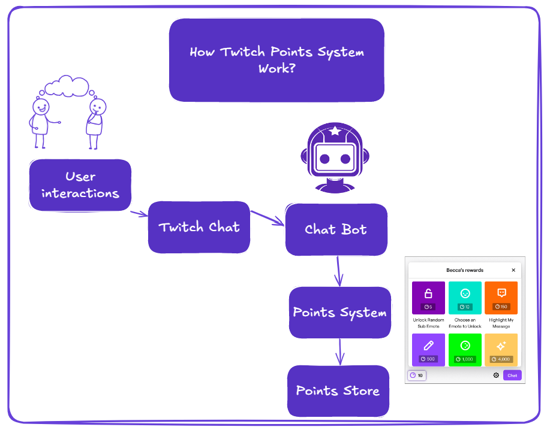

## Dataset

The dataset, sourced from **Teo Calvo’s (Teo Me Why) Twitch Points System**, captures real-world interactions within a loyalty program. It includes transactional data on point accrual, redemption, and customer behavior. The dataset is available on: https://www.kaggle.com/datasets/teocalvo/teomewhy-loyalty-system/data

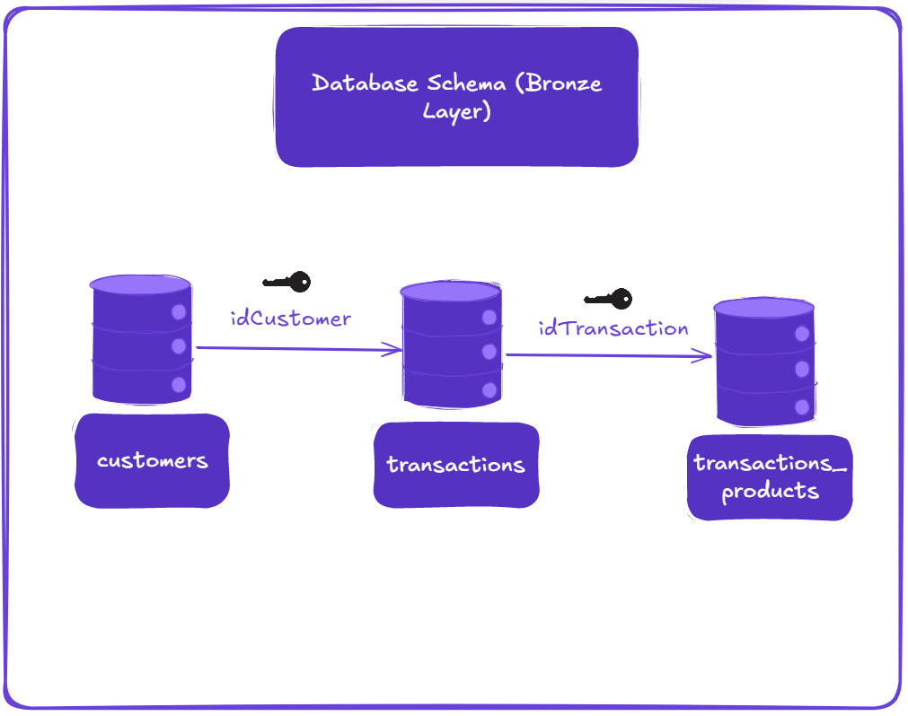

## Objectives

##### 1. **Develop a Predictive Model for Churn**
Build a machine learning algorithm to predict the likelihood of churn among Twitch users in Teo's Loyalty System.

##### 2. **User Segmentation through RFV Analysis**
Implement Recency, Frequency, and Value (RFV) analysis to segment users based on their activity and spending patterns. Categorize active users into stages of their life cycle and classify them into low, medium, and high tiers of engagement and value.

##### 3. **Create a Churn Decision-Making Framework**
Design a decision-making table that assigns each active user a churn probability alongside their respective life cycle stage and engagement/value category, providing actionable insights for community management.

### Database Schema: Bronze Layer

#### `transactions_products`

| Column              | Description                                              |
|---------------------|----------------------------------------------------------|
| `idTransactionCart` | Unique identifier for the transaction-product pair.      |
| `idTransaction`     | Unique identifier for the transaction.                  |
| `NameProduct`       | Name of the product included in the transaction.         |
| `QuantityProduct`   | Quantity of the product in the transaction.              |

---

#### `customers`

| Column             | Description                                                                 |
|--------------------|-----------------------------------------------------------------------------|
| `idCustomer`       | Unique identifier for the customer (primary key).                          |
| `PointsCustomer`   | Current points balance, updated with every new transaction for the customer.|
| `flEmail`          | Flag indicating if the customer has a registered email (0 = No, 1 = Yes).  |

---

#### `transactions`

| Column             | Description                                                                     |
|--------------------|---------------------------------------------------------------------------------|
| `idTransaction`    | Unique identifier for the transaction (primary key).                           |
| `idCustomer`       | Foreign key referencing the customer.                                          |
| `dtTransaction`    | Date and time of the transaction (UTC-0).                                      |
| `pointsTransaction`| Points associated with the transaction (positive = points earned, negative = points redeemed). |

---

## 🛠  Data Processing: Feature Store Creation (Silver Layer)

### What is a Feature Store? 

A Feature Store is a centralized system for managing features used in machine learning models. It ensures reusable, scalable, and automated feature engineering. By decoupling the feature store from the production database, we enable continuous data ingestion and flexible feature updates without altering the core system.

### Workflow

Starting from the bronze layer (database.db), we use SQL Common Table Expressions (CTEs) to create feature_store.db. This database forms the foundation for:

Churn Model Training: Features designed to predict user churn.
RFV Analysis: Metrics for user segmentation and marketing.
The Feature Store comprises four key tables:

**fs_hour:** Captures daily activity patterns.

**fs_points:** Tracks point balances and redemptions over time.

**fs_general**: Provides recency, frequency, and other customer-specific metrics.

**fs_products**: Analyzes product-specific behavior and preferences.


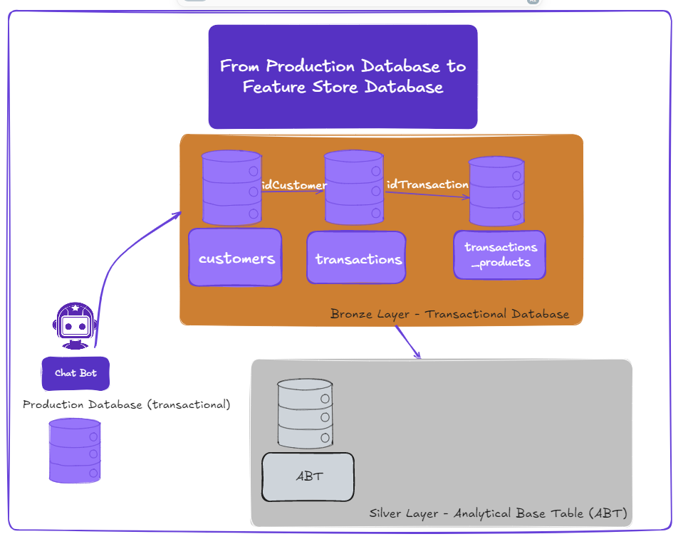

### Feature Store: `fs_general.sql`
---

#### Feature Store Queries

The following queries are part of the feature store and are used to generate feature sets for analysis. Each query aggregates customer transaction data, providing insights into customer behavior over different time periods.

#### Query: fs_hour.sql

**Description**: This query calculates features related to transaction times and customer points accumulation, focusing on daily patterns of activity.

#### Tables Used
- **transactions**: Contains customer transaction data, including transaction IDs, amounts, and timestamps.

#### Variables and Descriptions

| **Variable**          | **Description**                                                                                       |
|------------------------|-------------------------------------------------------------------------------------------------------|
| dtRef               | Reference date for the features.                                                                      |
| idCustomer          | Unique identifier for the customer.                                                                   |
| pointsMorning       | Total points earned in the morning (8:00 AM - 12:00 PM).                                              |
| pointsAfternoon     | Total points earned in the afternoon (12:00 PM - 6:00 PM).                                            |
| pointsEvening       | Total points earned in the evening (6:00 PM - 11:00 PM).                                              |
| pctPointsMorning    | Percentage of total points earned in the morning.                                                     |
| pctPointsAfternoon  | Percentage of total points earned in the afternoon.                                                   |
| pctPointsEvening    | Percentage of total points earned in the evening.                                                     |
| transactionsMorning | Total number of transactions made in the morning.                                                     |
| transactionsAfternoon | Total number of transactions made in the afternoon.                                                 |
| transactionsEvening | Total number of transactions made in the evening.                                                     |
| pctTransactionsMorning | Percentage of total transactions made in the morning.                                              |
| pctTransactionsAfternoon | Percentage of total transactions made in the afternoon.                                          |
| pctTransactionsEvening | Percentage of total transactions made in the evening.                                              |

---

#### Query: fs_points.sql

**Description**: This query calculates weekly and lifetime points balances, cumulative points earned, redeemed points, and average points per day for each customer.

#### Tables Used
- **transactions**: Contains customer transaction data, including transaction IDs, amounts, and timestamps.

#### Variables and Descriptions

| **Variable**          | **Description**                                                                                       |
|------------------------|-------------------------------------------------------------------------------------------------------|
| dtRef               | Reference date for the features.                                                                      |
| idCustomer          | Unique identifier for the customer.                                                                   |
| balancePointsW3     | Total points balance for first week.                                                            |
| balancePointsW2     | Total points balance for the second week.                                                            |
| balancePointsW1     | Total points balance for the third week.                                                               |
| pointsCumulativeW3  | Total cumulative points earned in the third week.                                                   |
| pointsCumulativeW2  | Total cumulative points earned in the second week.                                                   |
| pointsCumulativeW1  | Total cumulative points earned in the first week.                                                      |
| pointsRedeemW3      | Total points redeemed in the third week.                                                            |
| pointsRedeemW2      | Total points redeemed in the second week.                                                            |
| pointsRedeemW1      | Total points redeemed in the first week.                                                               |
| pointsBalance       | Lifetime total points balance.                                                                        |
| pointsCumulativeLife| Lifetime cumulative points earned.                                                                    |
| pointsRedeemLife    | Lifetime total points redeemed.                                                                       |
| daysLife            | Account age in days, from the earliest transaction date to the reference date.                        |
| pointsPerDay        | Average points redeemed per day over the customer's lifetime.                                         |

---

#### Query: fs_general.sql

**Description**: This query calculates recency, frequency, total points for the last 21 days, and other customer metrics like base age and email flag.

#### Tables Used
- **transactions**: Contains customer transaction data, including transaction IDs, amounts, and timestamps.
- **customers**: Contains customer data, including email flag.

#### Variables and Descriptions

| **Variable**      | **Description**                                                                                       |
|-------------------|-------------------------------------------------------------------------------------------------------|
| dtRef             | Reference date for the features.                                                                      |
| idCustomer        | Unique identifier for the customer.                                                                   |
| recencyDays       | Days since the most recent transaction (recency).                                                     |
| frequencyDays     | Number of distinct days with transactions in the last 21 days (frequency).                             |
| pointsValue       | Total points earned in the last 21 days.                                                              |
| baseAgeDays       | Number of days since the customer's last transaction (base age).                                      |
| flEmail           | Flag indicating if the customer has an email registered.                                              |

---

#### Query: fs_products.sql

**Description**: This query calculates product-specific features such as quantities, points, and percentages for the most frequent products purchased by customers in the last 21 days.

#### Tables Used
- **transactions**: Contains customer transaction data, including transaction IDs, amounts, and timestamps.
- **transactions_product**: Contains details about products in each transaction, including product names and quantities.

#### Variables and Descriptions

| **Variable**          | **Description**                                                                                       |
|-----------------------|-------------------------------------------------------------------------------------------------------|
| dtRef                 | Reference date for the features.                                                                      |
| idCustomer            | Unique identifier for the customer.                                                                   |
| qtyChatMessage        | Total quantity of 'ChatMessage' product purchased by the customer.                                     |
| qtyAttendanceList     | Total quantity of 'Lista de presença' product purchased by the customer.                              |
| qtyRedeemPony         | Total quantity of 'Resgatar Ponei' product purchased by the customer.                                 |
| qtyPointsExchange     | Total quantity of 'Troca de Pontos StreamElements' product purchased by the customer.                 |
| qtyStreakPresence     | Total quantity of 'Presença Streak' product purchased by the customer.                                |
| qtyAirflowLover       | Total quantity of 'Airflow Lover' product purchased by the customer.                                  |
| qtyRLover             | Total quantity of 'R Lover' product purchased by the customer.                                        |
| pointsChatMessage     | Total points earned from 'ChatMessage' product.                                                       |
| pointsAttendanceList  | Total points earned from 'Lista de presença' product.                                                |
| pointsRedeemPony      | Total points earned from 'Resgatar Ponei' product.                                                   |
| pointsPointsExchange  | Total points earned from 'Troca de Pontos StreamElements' product.                                    |
| pointsStreakPresence  | Total points earned from 'Presença Streak' product.                                                  |
| pointsAirflowLover    | Total points earned from 'Airflow Lover' product.                                                    |
| pointsRLover          | Total points earned from 'R Lover' product.                                                          |
| pctChatMessage        | Percentage of total quantity of 'ChatMessage' product purchased relative to all product quantities.   |
| pctAttendanceList     | Percentage of total quantity of 'Lista de presença' product purchased relative to all product quantities.|
| pctRedeemPony         | Percentage of total quantity of 'Resgatar Ponei' product purchased relative to all product quantities.|
| pctPointsExchange     | Percentage of total quantity of 'Troca de Pontos StreamElements' product purchased relative to all product quantities.|
| pctStreakPresence     | Percentage of total quantity of 'Presença Streak' product purchased relative to all product quantities.|
| pctAirflowLover       | Percentage of total quantity of 'Airflow Lover' product purchased relative to all product quantities. |
| pctRLover             | Percentage of total quantity of 'R Lover' product purchased relative to all product quantities.     |
| avgChatLive           | Average quantity of 'ChatMessage' product purchased per distinct transaction day.                    |
| maxQuantityProduct    | The product with the highest quantity purchased by the customer in the last 21 days.                  |


In sum, this is how our tables inside the Feature Store will look like:

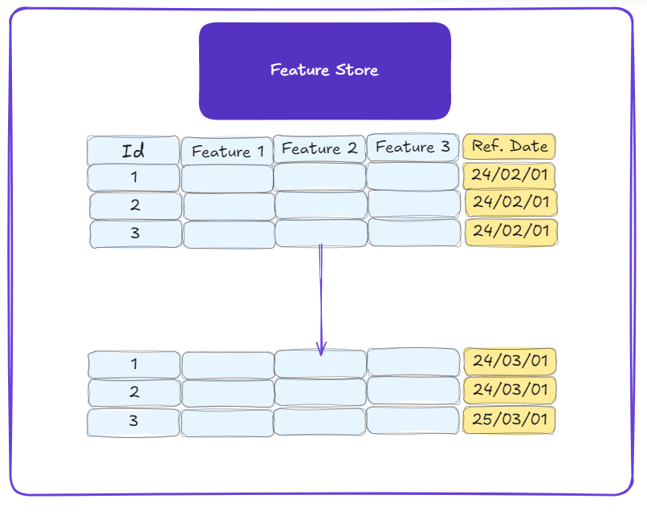


### Pipeline for Creating the Feature Store (`exec.sh`)

We automate the ingestion and transformation pipeline using exec.sh, which triggers execute.py. This ensures seamless integration between SQL queries and Python for constructing the feature store.

### Key Components

**Parameterized Queries**: SQL queries dynamically accept date ranges ({date}), enabling flexible cohort analysis.

**SQLAlchemy**: Facilitates interactions between SQLite and Python for data ingestion.

**Batch Processing**: Supports continuous integration of new data by appending processed records to feature_store.db.

### Workflow Steps

**SQL Execution**: Import queries, replace placeholders with date ranges, and execute against the production database.

**Data Ingestion**: Delete outdated records for the specified date range, then append new data.

**Batch Integration**: Process new records incrementally, ensuring up-to-date features for modeling.

## Creating the Analytical Base Table (ABT)

### Some Caveats About Time-Series Modeling

In our time-series modeling, we define a user as part of the **active base** if they have interacted with the platform (performed any transactions or activities) within the last **21 days** (3 weeks) relative to a given **reference date**. It’s important to note that the **active user base** will change based on the reference date we select. By adjusting the reference date in the SQL code, we can observe how the number of active users and their associated statistics shift, while maintaining the same **21-day window** for assessing user activity.

However, using a single, static active base could lead to issues, especially when considering **seasonality** and **volume fluctuations** over time. If we only focus on one reference date, our model may miss trends or changes in behavior that arise over different time periods. To address this, we create **cohorts** that allow us to model users across multiple time periods, providing better control over volume and seasonality effects. By analyzing different cohorts, we can ensure that the model is more reflective of real-world user behavior.

### Cohort Creation

We create **four cohorts** based on different reference dates and an **Out-of-Time (OOT) split** to evaluate how the model performs when tested on a different time window than the one used for training. The OOT split serves as a validation step, helping us understand how well the model generalizes to new data from a future time period. 

Each cohort represents a snapshot of the user base on the **1st day of each month**. This approach avoids the problem of replicating super-active users who might otherwise skew the model. By looking at the 1st day of each month for each cohort, we ensure that we are capturing a broad set of users, without over-representing those with frequent activity.

### Creating the Target Variable: Flagging Churn

The business problem of **churn** assumes that **recency** plays a key role: users with more recent activity are less likely to churn compared to those who have been inactive for a while. Instead of flagging churn on a daily basis (which would heavily emphasize recency), we take a slightly more balanced approach. By giving users a **21-day window** from their last recorded activity to return, we allow for some "grace period" before marking them as churned. This helps us avoid the potential bias of modeling churn purely based on recency.

#### Churn Flagging Logic:

A user is flagged as **churned** if they have not interacted with the platform or performed any transactions for at least **21 days** after their last recorded activity. The churn flag (`flChurn`) is set to `1` if no activity occurs within this period, indicating the user has churned. If the user is still active (i.e., interacts with the platform within the 21-day window), the flag is set to `0`.

### SQL Query Logic to Flag Churn:

The **`abt.sql`** query is designed to flag churn based on the following logic:
- It first identifies users who have no transactions or activities in the **21-day period following their last recorded activity** (`t1.dtRef`).
- Using a `LEFT JOIN`, it looks for records in `fs_general` for the same user (`t1.idCustomer`) 21 days after their last activity.
- If **no matching record exists** in the future (i.e., `t2.idCustomer IS NULL`), the user is flagged as churned (`flChurn = 1`).
- If a match exists (meaning the user has activity within the 21-day period), the flag is set to `0`, indicating the user remains active.

### Adjusting for Cohorts and OOT:

Additionally, the **OOT split** gives us a way to evaluate how the model performs on data from a future period, without having seen it during training. This is crucial for ensuring the model's ability to generalize and adapt to future trends in user behavior.

This flexible approach to defining churn and creating cohorts allows for easy adjustments should the definition of churn evolve, ensuring that we can continuously improve and adapt the model over time.


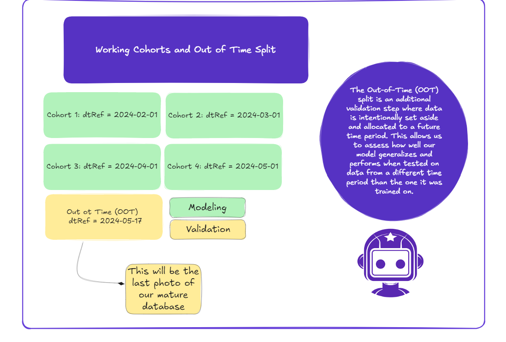


### Joining Feature Store Tables and the Target Variable

The **Analytical Base Table (ABT)** is constructed by joining all features from the Feature Store with the churn flag. This unified dataset serves as the foundation for modeling and evaluation. The modular design ensures that any updates to feature definitions or churn criteria automatically propagate to the ABT.

---

## SEMMA Framework Integration with MLflow for Churn Prediction

### **Objective** 1. 

**Develop a Predictive Model for Churn**
Build a machine learning algorithm to predict the likelihood of churn among Twitch users in Teo's Loyalty System.

The churn prediction model follows the **SEMMA** methodology, integrated with **MLflow** for experiment tracking and management. SEMMA consists of:

1. **Sample**: Select a representative dataset.
2. **Explore**: Analyze patterns and anomalies.
3. **Modify**: Engineer and transform features.
4. **Model**: Develop predictive models.
5. **Assess**: Evaluate model accuracy and reliability.


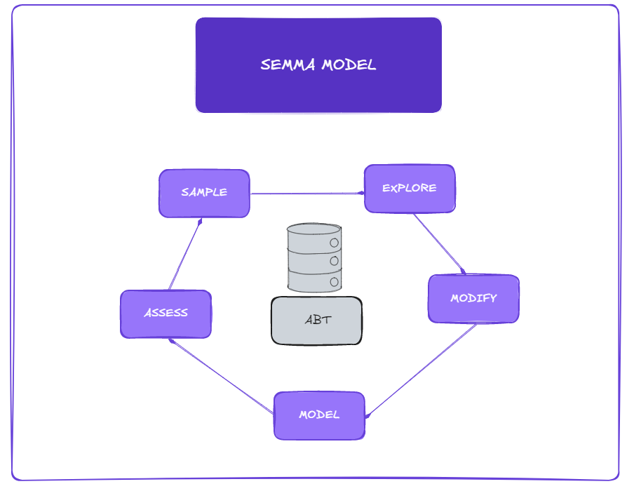

### Workflow for Model Development

#### 1. Data Import and Preprocessing
- Data is queried from the **ABT** using `abt.sql` and split into:
  - **Training set**
  - **Test set**
  - **Out-of-time (OOT) validation set**, representing the most recent data for temporal evaluation.

#### 2. Feature Engineering
- **One-hot encoding** is applied to categorical variables.
- Time-series data is handled using stratified sampling, ensuring robust validation.

#### 3. Model Selection and Tuning
- - Various classifiers (e.g., `RandomForest`, `GradientBoosting`, `AdaBoosting`, `BaggingClassifier` and `LightGBMClassifer`) are evaluated.
- **BaggingClassifier** with `DecisionTreeClassifier` as the base estimator.

### 4. Main Workflow for Model Selection 
### Steps for Hyperparameterization and Cross-Validation

1. **Define Hyperparameter Grid**  
   Created a grid with parameter ranges for each specific algorithm to explore diverse configurations.

2. **Iterative Search**  
   Utilized `ParameterGrid` to systematically generate all possible hyperparameter combinations for evaluation.

3. **Cross-Validation**  
   Applied 3-fold cross-validation for each combination using `cross_val_score`, with the primary metric being the mean ROC AUC score.

4. **Progress Tracking**  
   Integrated a progress bar (`tqdm`) to track the progress of the grid search iterations and ensure efficient monitoring.

5. **Select Best Parameters**  
   Identified the hyperparameter combination with the highest ROC AUC score as the optimal configuration.

6. **Refit Model**  
   Re-trained the model pipeline with the best hyperparameters on the entire training dataset for final evaluation.

7. **Performance Reporting**  
   Calculated and logged key performance metrics (e.g., accuracy, precision, recall, ROC AUC) for training, testing, and out-of-time (OOT) datasets for comprehensive model evaluation inside mlflow.

### 5. Model Evaluation
- Models are assessed using those performance metrics: **ROC AUC**, **accuracy**, **precision**, and **recall** across:

  - **Training set**
  - **Test set**
  - **OOT set**

### 6. MLflow Integration
- MLflow tracks metrics and hyperparameters during training.
- The best-performing model is serialized and saved for deployment.

---

## Results

After rigorous evaluation, **RandomForest** was selected as the production model due to its balanced performance:

| Dataset  | Accuracy | ROC AUC | Precision | Recall |
|----------|----------|---------|-----------|--------|
| Train    | 0.77     | 0.85    | 0.72      | 0.78   |
| Test     | 0.76     | 0.81    | 0.70      | 0.83   |
| OOT      | 0.73     | 0.80    | 0.68      | 0.65   |

---

## In-Depth Analysis of Model Performance in the Context of Customer Churn

In the `best_model.py` script, we conduct a comprehensive analysis of our model's performance, particularly in addressing the churn problem. The evaluation focuses on the Out-of-Time (OOT) validation set, which reflects real-world conditions. Key findings from this analysis are visualized in the `train/plots` directory and are discussed below.

### **Evaluating Model Recall through Cumulative Gains**

To assess the model's ability to identify churners, we analyze its performance across different probability thresholds. By ranking users based on their predicted likelihood of churn, the model allows prioritization of high-risk segments. Here’s a breakdown:

1. **Top 20% of Users by Predicted Churn Probability**  
   Targeting the top 20% of users with the highest churn probabilities captures nearly 40% of all actual churners. This represents **double the effectiveness** of a random baseline model, which would capture only 20%.

2. **Top 30% of Users**  
   Expanding the coverage to the top 30% captures approximately 50% of churners.

3. **Full Dataset**  
   Covering 80% of the dataset enables the identification of 100% of churners. This progression is visualized in the cumulative gains plot below:

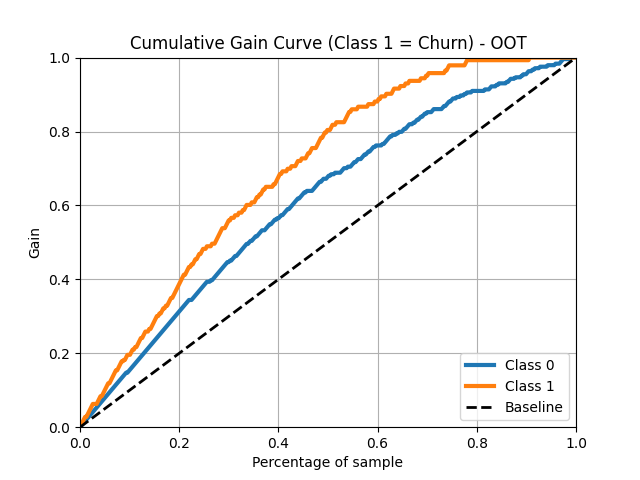

### **Lift Curve: Quantifying Model Effectiveness**

The lift curve further highlights the model's predictive strength by comparing its performance against a random baseline. For instance:

- By targeting the top 20% of users, the model captures **twice as many churners** compared to random selection.

Additionally, focusing on the top 100 users with the highest churn probabilities yields:
- **Model Performance**: 72% of these users are actual churners.
- **Baseline Performance**: Only 37% would be churners, based on the dataset's overall churn rate.

This improvement is consistent with the lift curve, emphasizing the model’s strong ability to prioritize churn risks.

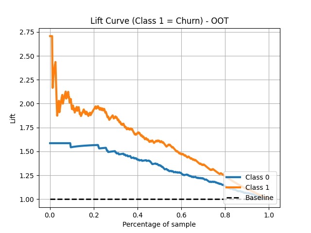

### **Precision-Recall Curve Analysis**

The Precision-Recall (PR) curve provides crucial insights into how well the model handles the imbalanced churn dataset. Key takeaways include:

1. **Class 1 (Churn)**:
   - Precision starts high but decreases as recall increases, reflecting the challenge of maintaining precision when capturing more churners.
   - The area under the curve (AUC) for churners is **0.674**, highlighting good model performance.

2. **Class 0 (Non-Churn)**:
   - The AUC is **0.889**, demonstrating robust performance in identifying non-churners.

3. **Micro-Averaged Curve**:
   - AUC = **0.830**, summarizing overall model performance across both classes.

The PR curve underscores the model's capability to balance precision and recall effectively, especially for identifying churners (Class 1).

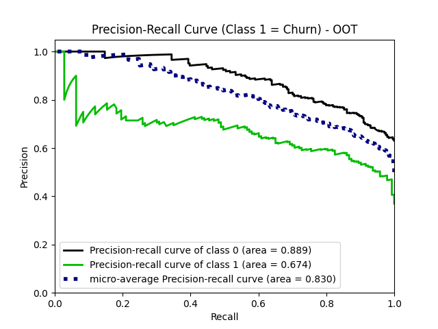

### **ROC Curve Analysis**

The Receiver Operating Characteristic (ROC) curve evaluates the model’s ability to distinguish between churners (Class 1) and non-churners (Class 0). Key insights include:

1. **Class 0 and Class 1**:
   - Both classes achieve an AUC of **0.81**, indicating good discrimination.

2. **Micro-Averaged Curve**:
   - AUC = **0.82**, reflecting strong overall performance.

3. **Macro-Averaged Curve**:
   - AUC = **0.81**, consistent with individual class performance.

The ROC curve confirms the model's effectiveness in separating the two classes, with a balance between True Positive Rate (TPR) and False Positive Rate (FPR).

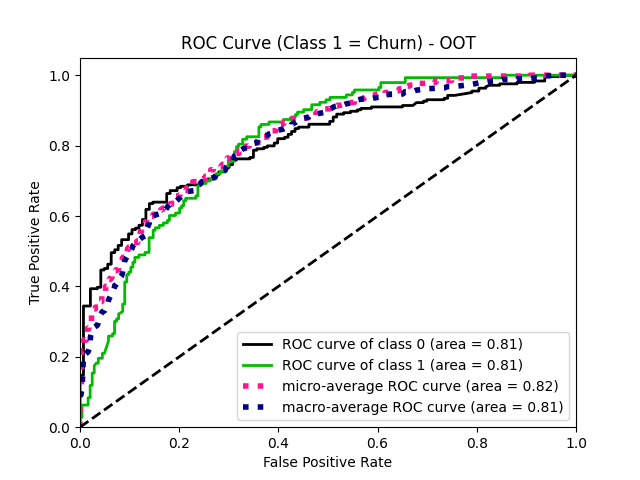

### KS Statistic: Measuring Model Discrimination

To further validate the model's performance, we use the KS (Kolmogorov-Smirnov) statistic. The KS statistic measures the maximum separation between the cumulative distribution functions (CDFs) of two groups—in this case, churners (positive class, Class 1) and non-churners (negative class, Class 0). The statistic helps evaluate the ability of a model to distinguish between these two classes. A higher KS value indicates better discriminatory power.

In this sense: 

- A higher KS value indicates better discrimination. Ideally, the model should produce well-separated probability distributions for the two classes.

#### Results
Using the following code:

```python
skplt.metrics.plot_ks_statistic(df_OOT[target], y_oot_proba, title="KS Statistic (Class 1 = Churn) - OOT")
```

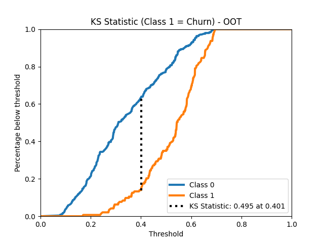

KS Value = **0.49**:
The maximum separation between the two CDFs (churners and non-churners) is **49%**, which is a strong indication that the model can effectively differentiate between the two groups.

Threshold = **0.40**:
At a probability threshold of **0.40**, the model achieves this maximum separation. This means the model's predictions are most effective at distinguishing churners from non-churners when classifying users with a predicted probability of churn around **40%**.

--- This adress our first question 

1. **Develop a Predictive Model for Churn**
Build a machine learning algorithm to predict the likelihood of churn among Twitch users in Teo's Loyalty System.

## **User Segmentation through RFV Analysis**


### **Objective** 2.

Utilize Recency, Frequency, and Value (RFV) analysis to segment users based on their activity and spending patterns. This segmentation categorizes active users into lifecycle stages and engagement tiers (low, medium, high), enabling targeted retention strategies.

### **Defining Lifecycle Stages**

Lifecycle stages are defined using **recency** (days since last activity) and **base age** (days since user joined the platform). The cumulative distribution of active users based on recency is visualized to establish thresholds for each stage.

#### **Code for Lifecycle Analysis**
```python
# Prepare a DataFrame for cumulative recency analysis
df_recency = df[["recencyDays", "baseAgeDays"]].sort_values(by="recencyDays")

# Add a column to represent each user as a unit
df_recency['unit'] = 1

# Calculate the cumulative count of users by recency
df_recency['Cumulative'] = df_recency['unit'].cumsum()

# Compute cumulative percentage of users
df_recency["Cumulative Percentage"] = df_recency['Cumulative'] / df_recency['Cumulative'].max()

# Plot the cumulative percentage against recency days
plt.plot(df_recency["recencyDays"], df_recency["Cumulative Percentage"], label="Cumulative Percentage")
```

We achieve this segmentation: 

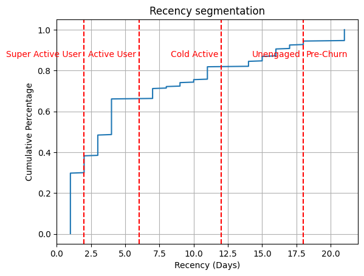

This is how i setted the lifecycle stages: 

Users are categorized into **lifecycle stages** based on **recency** (days since last activity) and **base age** (age in days in the base):

| **Lifecycle Stage** | **Definition**                |
|---------------------|-------------------------------|
| **New User**        | Base age ≤ 7 days            |
| **Super Active**    | Recency ≤ 2 days             |
| **Active**          | Recency ≤ 6 days             |
| **Cold Active**     | Recency ≤ 12 days            |
| **Unengaged**       | Recency ≤ 18 days            |
| **Pre-Churn**       | Recency > 18 days            |

#### Lifecycle Distribution Summary:

| **Stage**           | **Avg. Recency (Days)** | **Count** | **Avg. Base Age (Days)** |
|---------------------|-------------------------|-----------|--------------------------|
| **Super Active**    | 1.23                   | 137       | 81.04                   |
| **Active**          | 3.59                   | 82        | 71.45                   |
| **Cold Active**     | 9.25                   | 63        | 82.84                   |
| **Pre-Churn**       | 21.00                  | 23        | 50.87                   |
| **New User**        | 2.89                   | 56        | 3.63                    |


### Lifecycle Insights:
- **Super Active Users**:
  - Largest group with the highest engagement and long tenure.
  - **Actionable Insight**: Maintain their loyalty through exclusive content or reward programs.
- **Pre-Churn Users**:
  - Lowest recency but newer than most groups, signaling early disengagement.
  - **Actionable Insight**: Use re-engagement campaigns to retain these users.
---

## **RFV Segmentation: Understanding User Value and Engagement**

### **Segmentation Process**

Using frequency and value features, a systematic segmentation approach was implemented as follows:

1. **Scatterplot Creation**  
   A simple scatterplot visualizing points vs. frequency to identify patterns in user behavior.  
   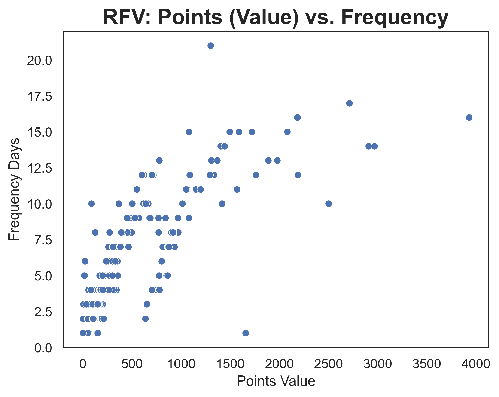

2. **Initial Clustering with Agglomerative Clustering**  
   Agglomerative clustering was applied to group users based on frequency and value, providing a preliminary segmentation for further refinement.  
   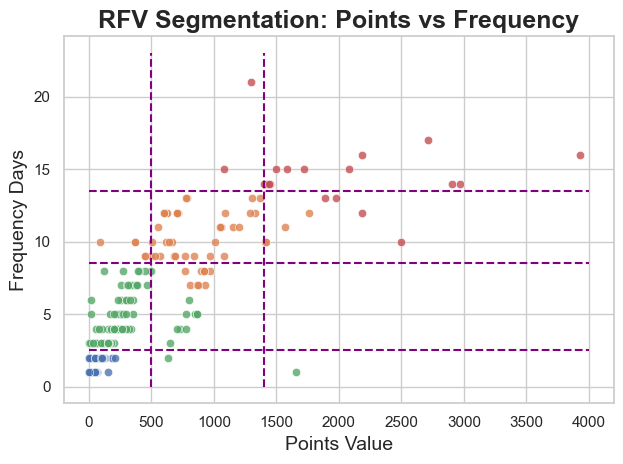

3. **Threshold Definition**  
   Visual inspection of the clustering results was used to establish thresholds for segmentation.

4. **Final Segmentation**  
   Twelve detailed segments were defined based on combinations of **Low, Medium, High Value × Low, Medium, High, Very High Frequency**.  
   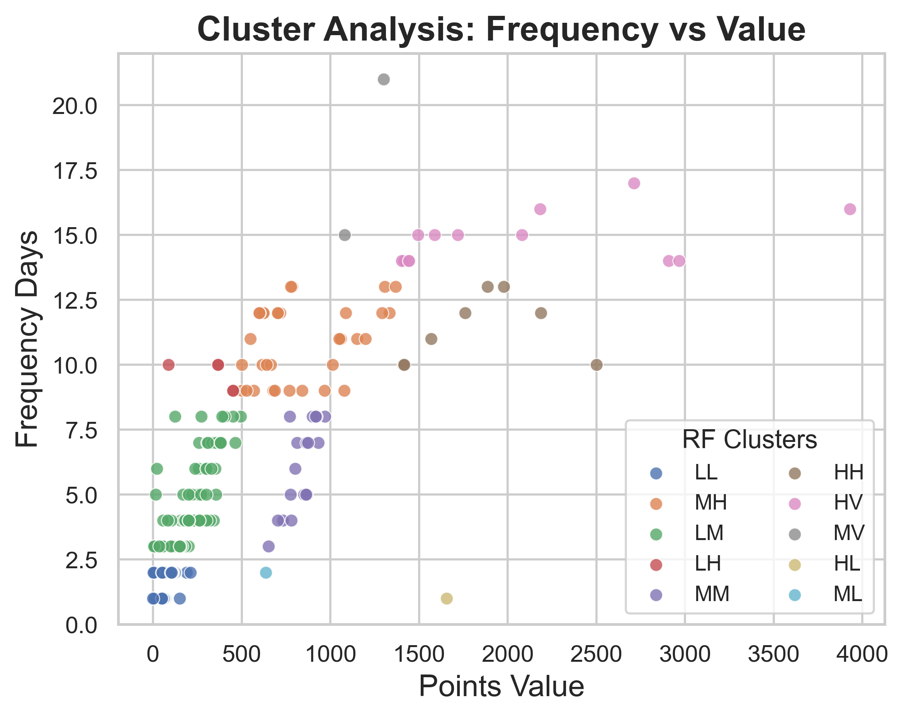

---

### **Final RFV Segments**

| **Segment** | **Description**                  | **Thresholds**                                   | **Count** | **Percentage (%)** |
|-------------|----------------------------------|-------------------------------------------------|-----------|--------------------|
| **LL**      | Low Value, Low Frequency         | `pointsValue < 500` and `frequencyDays < 2.5`   | 218       | 37.71             |
| **LM**      | Low Value, Medium Frequency      | `pointsValue < 500` and `2.5 ≤ frequencyDays < 8.5` | 112   | 19.47             |
| **LH**      | Low Value, High Frequency        | `pointsValue < 500` and `8.5 ≤ frequencyDays < 13.5` | 63    | 10.90             |
| **LV**      | Low Value, Very High Frequency   | `pointsValue < 500` and `frequencyDays ≥ 13.5`  | 20        | 3.46              |
| **ML**      | Medium Value, Low Frequency      | `500 ≤ pointsValue < 1400` and `frequencyDays < 2.5` | 56    | 9.69              |
| **MM**      | Medium Value, Medium Frequency   | `500 ≤ pointsValue < 1400` and `2.5 ≤ frequencyDays < 8.5` | 18 | 3.14              |
| **MH**      | Medium Value, High Frequency     | `500 ≤ pointsValue < 1400` and `8.5 ≤ frequencyDays < 13.5` | 34 | 5.92              |
| **MV**      | Medium Value, Very High Frequency | `500 ≤ pointsValue < 1400` and `frequencyDays ≥ 13.5` | 10  | 1.73              |
| **HL**      | High Value, Low Frequency        | `pointsValue ≥ 1400` and `frequencyDays < 2.5` | 8        | 1.38              |
| **HM**      | High Value, Medium Frequency     | `pointsValue ≥ 1400` and `2.5 ≤ frequencyDays < 8.5` | 5   | 0.87              |
| **HH**      | High Value, High Frequency       | `pointsValue ≥ 1400` and `8.5 ≤ frequencyDays < 13.5` | 7   | 1.21              |
| **HV**      | High Value, Very High Frequency  | `pointsValue ≥ 1400` and `frequencyDays ≥ 13.5` | 14       | 2.43              |

---

### **Insights from RFV Segmentation**

- **LL (Low Value, Low Frequency)**: Largest group, representing minimal engagement and contribution.  
  **Actionable Insight**: Investigate reasons for low activity and implement campaigns to encourage engagement.

- **HV (High Value, Very High Frequency)**: Small but highly valuable segment, critical to retention strategies.  
  **Actionable Insight**: Reward loyalty and incentivize continued activity with exclusive perks.

- **LM, MH & HH**: Mid-tier users with potential for growth into higher value segments.  
  **Actionable Insight**: Offer targeted promotions to enhance frequency or value of interactions.

- **LV, MV & HV**: Users with high engagement but varying value levels.  
  **Actionable Insight**: Design loyalty programs to sustain and enhance activity among these groups.

By leveraging these RFV segments, more tailored strategies can be implemented to improve user retention and maximize value.

### **Final RFV Segments**

| **Segment** | **Description**                   | **Count** | **Percentage (%)** |
|-------------|-----------------------------------|-----------|--------------------|
| **LL**      | Low Value, Low Frequency          | 218       | 37.71              |
| **LM**      | Low Value, Medium Frequency       | 112       | 19.47              |
| **MH**      | Medium Value, High Frequency      | 34        | 5.92               |
| **MM**      | Medium Value, Medium Frequency    | 18        | 3.14               |
| **HV**      | High Value, Very High Frequency   | 14        | 2.43               |
| **HH**      | High Value, High Frequency        | 8         | 1.38               |
| **LH**      | Low Value, High Frequency         | 5         | 0.87               |
| **MV**      | Medium Value, Very High Frequency | 2         | 0.35               |
| **HL**      | High Value, Low Frequency         | 1         | 0.17               |
| **ML**      | Medium Value, Low Frequency       | 1         | 0.17               |

---

### **Key Insights**:

- **LL and LM Segments**:
  - Represent **56%** of users, providing an opportunity to design campaigns that enhance engagement and increase lifetime value.
  - **Actionable Insight**: Launch targeted campaigns, such as points incentives or personalized offers, to convert these segments to higher-value categories.

- **HV and HH Segments**:
  - Small but crucial groups that contribute significantly to revenue.
  - **Actionable Insight**: Focus retention efforts here with premium experiences, exclusive content, or VIP programs to sustain their high value.

- **LH and MV Segments**:
  - Users in these segments show potential for growth but may need additional engagement to increase both frequency and value.
  - **Actionable Insight**: Provide personalized offers or special events to encourage increased activity.

---
## **Business Implications and Next Steps**

1. **Target Top Churn Predictions**:
   - Focus retention efforts on the top 20%-30% of users as predicted by the model.

2. **Preventative Engagement**:
   - Address early disengagement in **Pre-Churn Users** with tailored reactivation strategies.

3. **Upgrade Low/Medium Segments**:
   - Incentivize **LL and LM users** through campaigns designed to increase frequency and engagement.

4. **Reward High-Value Users**:
   - Invest in retention strategies for **HV and HH segments**, ensuring long-term loyalty and consistent revenue.

By aligning strategies with these insights, businesses can maximize retention, minimize churn, and enhance overall user value.

## 📈 Insights and Conclusions

### **Objective** 3. 

**Create a Churn Decision-Making Framework (Gold Layer)**

In **`customer_profile.py`**, we consolidate the outputs of the churn prediction model, lifecycle segmentation, and frequency-value segmentation into a comprehensive decision-making table. This table provides actionable insights for retention strategies by highlighting:

- **Churn Probability**: The likelihood of each user churning, as predicted by the ML model.
- **Life Cycle Segmentation**: User categorization based on engagement and recency.
- **Frequency-Value Segmentation**: User classification based on activity frequency and points value.

### Example Table:

| dtRef       | idCustomer                             | Life Cycle Segmentation | Frequency Value Segmentation | Churn Probability | dtUpdate                    |
|-------------|----------------------------------------|-------------------------|------------------------------|--------------------|-----------------------------|
| 2024-06-07  | 000ff655-fa9f-4baa-a108-47f581ec52a1  | Cold Active             | Low Value, Low Frequency     | 0.516375           | 2024-11-28 19:30:56.922235 |
| 2024-06-07  | 0019bb9e-26d4-4ebf-8727-fc911ea28a92  | Super Active User       | Low Value, Low Frequency     | 0.058285           | 2024-11-28 19:30:56.922235 |
| 2024-06-07  | 00a6d4c8-38e5-4e92-981e-4e4ac5084546  | Super Active User       | Medium Value, High Frequency | 0.010680           | 2024-11-28 19:30:56.922235 |
| 2024-06-07  | 02cb6641-a115-4c53-a6ab-22b332d8e5e2  | Unengaged               | Low Value, Low Frequency     | 0.794619           | 2024-11-28 19:30:56.922235 |
| 2024-06-07  | 0368a5c3-bc5d-45f2-b8a0-07e74ea1574f  | Active User             | Low Value, Low Frequency     | 0.274932           | 2024-11-28 19:30:56.922235 |

This comprehensive table allows for tailored retention strategies:
- For **Unengaged** and **Cold Active** users, focus on increasing activity frequency and value.
- For **New Users**, design onboarding strategies to encourage engagement.
- **Super Active Users** exhibit the lowest churn probability, suggesting they are the most stable segment.

### Key Insight:
Super Active Users have the highest engagement and retention, while Unengaged users show a significantly higher risk of churning. These patterns reinforce the importance of lifecycle and segmentation data in guiding retention strategies.

---

## 📜 Project Structure

The project is organized as follows:
```
├── README.md
├── data/
│   ├── database.db
│   └── feature_store.db
├── models/
│   ├── cluster_fv_01.pkl
│   ├── cluster_rf_01.pkl
│   └── rf_01.pkl
├── src/
│   ├── feature_store/
│   │   ├── exec.sh
│   │   ├── execute.py
│   │   ├── fs_general.sql
│   │   ├── fs_hour.sql
│   │   ├── fs_points.sql
│   │   ├── fs_products.sql
│   │   └── fs_transactions.sql
│   ├── predict/
│   │   ├── customer_profile.py
│   │   ├── etl.sql
│   │   └── predict_mlflow.py
│   ├── rfv/
│   │   ├── rfv_frequency.py
│   │   └── rfv_recency.py
│   ├── train/
│   │   ├── plots/
│   │   │   ├── cumulative_gain_curve.png
│   │   │   ├── ks_statistic.png
│   │   │   ├── lift_curve.png
│   │   │   ├── precision_recall_curve.png
│   │   │   └── roc_curve.png
│   │   ├── abt.sql
│   │   ├── best_model.py
│   │   ├── eda.py
│   │   ├── train.py
│   │   └── train_mlflow.py
│   ├── pipeline.sh
├── project_structure.py
├── requirements.txt

```

### Directory Highlights:
- **`data/`**: Contains raw and processed databases.
- **`models/`**: Stores trained models for segmentation and churn prediction.
- **`src/`**: Houses scripts for feature engineering, training, and prediction.
- **`plots/`**: Includes evaluation plots for the churn model.
- **`images/`**: Includes images and schemas for the project.

---

## 🚧 Project Next Steps

### 1. Deploying a Streamlit App
The next step is to integrate the project into a **Streamlit** app, creating an end-to-end solution. This app will provide:
- Real-time churn predictions.
- Visualization of lifecycle and frequency-value segments.
- Tools for retention strategy planning.

### 2. Feature Optimization
- Analyze feature importance in the **RandomForest** model.
- Remove low-contribution variables and retrain the model to enhance performance, increasing the parcimony of the model


### 3. Advanced Use Cases
- Explore time-based retention campaigns by leveraging churn probabilities.
- Tailor strategies for key lifecycle segments, such as **Cold Active** or **Pre-Churn** users.

By integrating predictive analytics with actionable insights, this project delivers a robust tool for Twitch user retention.
